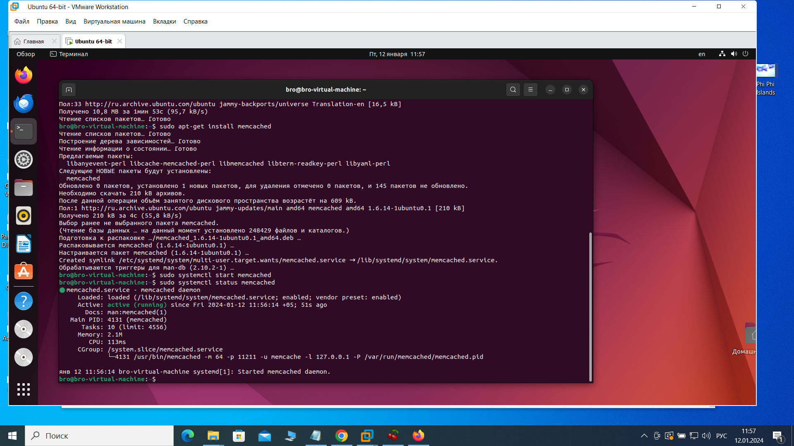
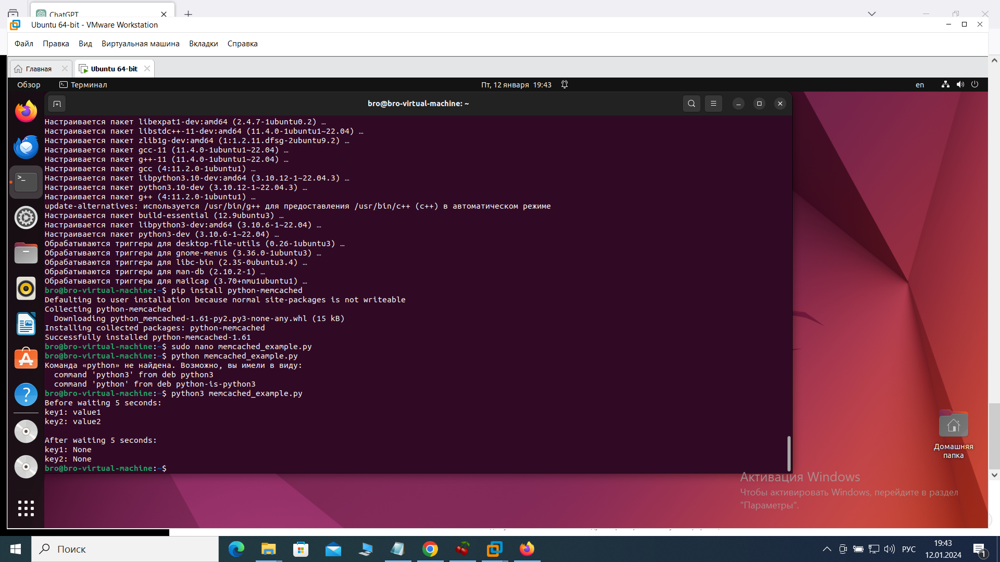
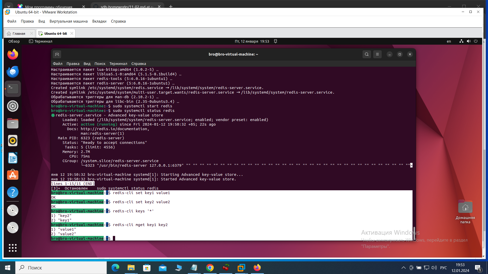
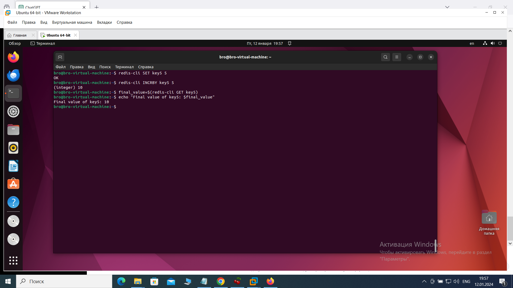

Домашнее задание по занятию «Кеширование Redis/memcached» Брюхов А SYS-26

Задание 1. Кеширование
Приведите проблемы, которые могут решить кеширование.

Примите ответ в свободной форме.

Решение 1.

Кеширование - это техника оптимизации производительности, которая заключается в сохранении результатов выполнения операций, чтобы в будущем можно было использовать сохраненные результаты, вместо повторного выполнения операции. Вот несколько проблем, которые кеширование может решить:

   1. Увеличение производительности: Кеширование позволяет избежать повторного выполнения операций, которые уже были выполнены ранее. Это особенно полезно для операций с высокой стоимостью вычислений или операций, требующих значительных ресурсов.

   2. Снижение нагрузки на сервер: Кеширование может снизить нагрузку на сервер, так как часть запросов может быть обработана из кеша без обращения к более медленным источникам данных.

   3. Улучшение отзывчивости системы: Запросы, обработанные из кеша, могут быть обработаны быстрее, что приводит к улучшению отзывчивости системы.

   4. Снижение задержек в сети: Кеширование на клиентской стороне или промежуточных уровнях сети может снизить задержки при передаче данных.

   5. Экономия ресурсов: Кеширование позволяет избежать избыточных вычислений или обращений к базе данных, что экономит ресурсы системы.

Задание 2. Memcached
Установите и запустите memcached.
При создании скриншота systemctl status memcached, где будет видно, что memcached запущен.

Решение 2.
Установка и запуск Memcached:
Для систем на базе Debian/Ubuntu:

sudo apt-get update
sudo apt-get install memcached

Запуск Memcached:

sudo systemctl start memcached

Проверка статуса Memcached:

systemctl status memcached

Задание 3.
Удаление по TTL в Memcached
Запишите в memcached несколько ключей с любыми именами и значениями, для которых выставлен TTL 5.
При создании скриншота видно, что спустя 5 секунд ключи убрались из базы.

Решение 3.
1.Устанавил библиотеку:
pip install python-memcached

2.Создал скрипт на Python для работы с Memcached: memcached_example.py:

import memcache
import time

# Подключение к серверу Memcached
mc = memcache.Client(['127.0.0.1:11211'], debug=0)

# Запись ключей с TTL
mc.set('key1', 'value1', time=5)
mc.set('key2', 'value2', time=5)

# Печать текущих значений
print("Before waiting 5 seconds:")
print("key1:", mc.get('key1'))
print("key2:", mc.get('key2'))

# Ждем 5 секунд
time.sleep(5)

# Печать значений после истечения 5 секунд
print("\nAfter waiting 5 seconds:")
print("key1:", mc.get('key1'))
print("key2:", mc.get('key2'))

3.Запустил скрипт:

python3 memcached_example.py

Этот скрипт подключается к серверу Memcached, записывает два ключа (key1 и key2)
со значениями и TTL 5 секунд, а затем ждет 5 секунд. После этого он выводит текущие 
значения ключей, как они были до ожидания, и значения после ожидания, 
чтобы мы могли убедиться, что ключи были удалены из-за истечения TTL. 

Задание 4. Запись данных в Redis
Запишите в Redis несколько ключей с любыми именами и значениями.
С помощью redis-cli достаньте все указанные ключи и значения базы, при выполнении 
скриншота этой операции.

Решение 4.
1.Установка Redis:
 Для систем на базе Debian/Ubuntu:

sudo apt-get update
sudo apt-get install redis-server

2.Запуск Redis:

sudo systemctl start redis

3.Запись данных в Redis:

redis-cli set key1 value1
redis-cli set key2 value2

4.Достал все ключи и значения:

redis-cli keys '*'
redis-cli mget key1 key2

Задание 5*. Работа с числами
Запишите в Redis ключ key5 со значением типа "int" с условием 5. Увеличьте его на 5, 
чтобы в итоге в выражение положить число 10.
При создании скриншота, где будут выполнены все операции, и будет видно, 
что значение key5 было равно 10.

Решение 5.

Использую redis-cli. 

redis-cli SET key5 5     # Запись ключа key5 со значением 5 типа "int"
redis-cli INCRBY key5 5  # Увеличение значения ключа на 5

final_value=$(redis-cli GET key5)
echo "Final value of key5: $final_value" # Получение и вывод окончательного значения

Эти команды выполняют действия: записывают ключ 'key5' со значением 5, 
увеличивают его на 5 и выводят окончательное значение.

